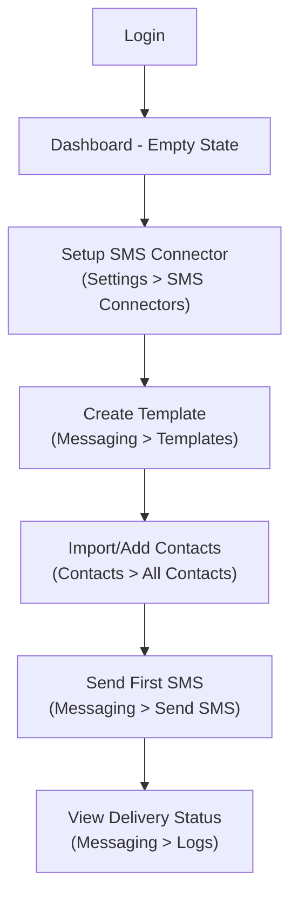
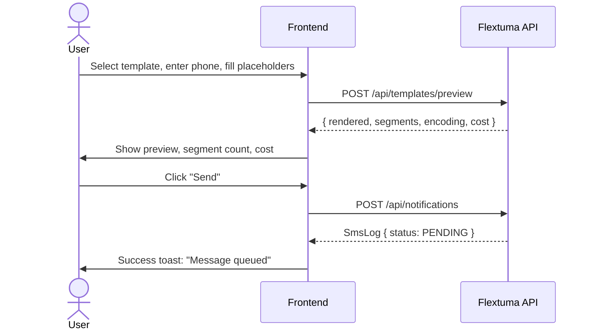
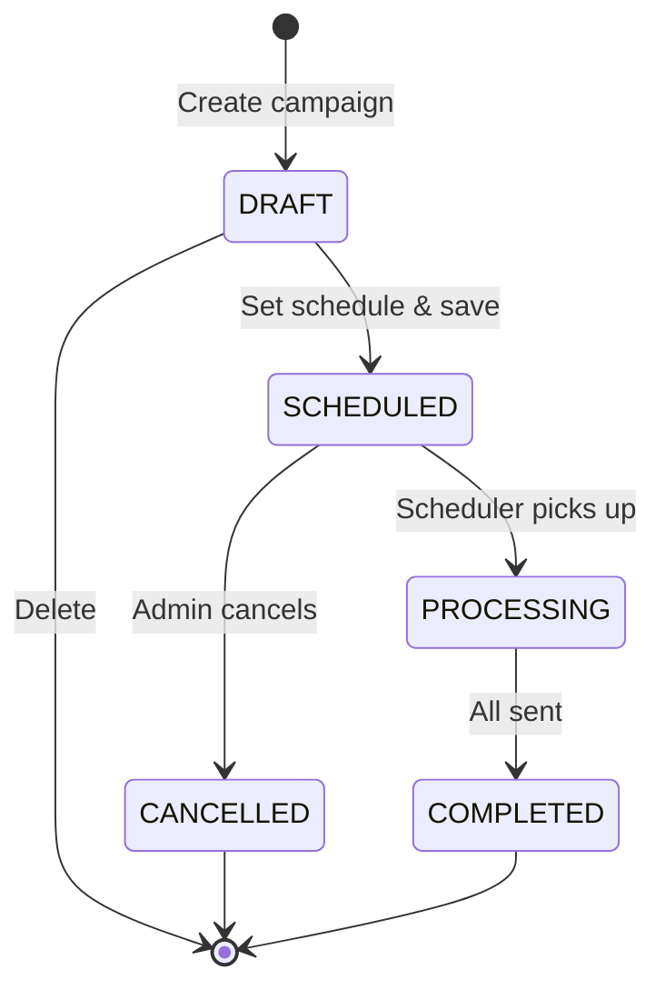

# Flextuma Frontend Design Specification

> **Document purpose:** Provide a frontend designer/developer with everything needed to design and build a web UI that completes the Flextuma messaging gateway end-to-end.

---

## 1. Product Summary

Flextuma is a **multi-tenant messaging gateway** for organisations (SACCOs). It lets organisations:

1. **Configure SMS providers** (Beem, NextSMS, etc.)
2. **Create message templates** with `{placeholder}` variables
3. **Manage contacts** organised by Tags and Lists
4. **Send SMS** — individually (templated or raw) or via scheduled campaigns
5. **Monitor delivery** — view logs, retry failures, track status lifecycle
6. **Manage finances** — wallet balance, top-ups, per-segment cost deductions
7. **Connect to external ERPs** to hydrate template data dynamically

The backend is built, tested, and has a full REST API. The frontend must bring this to life as an **internal admin dashboard**.

---

## 2. User Roles & Access Model

### 2.1 Role Hierarchy

| Role | Description | Sees |
|------|-------------|------|
| **Super Admin** | Platform operator, full access to all orgs | All data across all tenants |
| **Org Admin** | Manages their organisation's resources | Only data from their own organisation |
| **Org User** | Standard user within an org | Only their own records + org records |

### 2.2 Permission System

Every resource enforces 4 permissions: `READ_*`, `ADD_*`, `UPDATE_*`, `DELETE_*`.
The frontend should:
- **Conditionally render** action buttons (Create, Edit, Delete) based on the permissions returned in the `/api/me` response
- **Disable or hide** menu items the user has no `READ_*` permission for
- Users with `SUPER_ADMIN` or `ALL` authority bypass all checks

### 2.3 Feature Flags (Org-Level)

Some features can be gated per-organisation (e.g. `BULK_CAMPAIGN`, `CONNECTOR_PULL`).
If a gated action returns `403`, the UI should show a clear "This feature is not available for your plan" message — not a generic error.

---

## 3. Authentication & Session

### 3.1 Login Flow

| Step | Detail |
|------|--------|
| **Endpoint** | `POST /api/login` with `{ "username": "...", "password": "..." }` |
| **Response** | The authenticated `User` object + a `SESSION` HttpOnly cookie |
| **CSRF** | Response includes `XSRF-TOKEN` cookie. All subsequent `POST`/`PUT`/`DELETE` requests must send `X-CSRF-TOKEN` header with this value |
| **Persistence** | Session is stored in Redis server-side; cookie-based `credentials: 'include'` on all fetches |
| **Concurrent sessions** | Maximum **1 session per user** — logging in elsewhere invalidates the old session |

### 3.2 Session Check

On app initialisation, call `GET /api/me`:
- **200** → user is authenticated, proceed and cache the user object
- **401** → redirect to login page

### 3.3 Logout

`POST /api/logout` — clears the session cookie.

---

## 4. Core API Conventions

Every resource follows the same pattern via `BaseController`:

| Action | Method | Endpoint | Notes |
|--------|--------|----------|-------|
| **List (paginated)** | `GET` | `/api/{resource}?page=0&size=20` | Returns `{ page, total, pageSize, {resource}: [...] }` |
| **Filter** | `GET` | `/api/{resource}?filter=field:OP:value` | Operators: `EQ`, `NE`, `LIKE`, `ILIKE`, `IN`, `GT`, `LT` |
| **Multiple filters** | `GET` | `?filter=a:EQ:1&filter=b:GT:5&rootJoin=AND` | `rootJoin` = `AND` (default) or `OR` |
| **Select fields** | `GET` | `?fields=name,status` | Sparse field selection |
| **Get by ID** | `GET` | `/api/{resource}/{id}` | 200 or 404 |
| **Get fields schema** | `GET` | `/api/{resource}/fields` | Returns `EntityFieldDTO[]` — useful for dynamic form generation |
| **Aggregate** | `GET` | `/api/{resource}/aggregate?aggregate=COUNT(id):total&groupBy=status` | For dashboard charts/stats |
| **Create** | `POST` | `/api/{resource}` | Body = entity JSON |
| **Update** | `PUT` | `/api/{resource}/{id}` | Partial update (null-safe) |
| **Delete** | `DELETE` | `/api/{resource}/{id}` | Returns `{ "message": "..." }` |
| **Bulk delete** | `DELETE` | `/api/{resource}/bulky?filter=...` | Deletes matching records |

### 4.1 Error Codes

| Code | Meaning | Frontend Action |
|------|---------|-----------------|
| `400` | Validation error / missing fields | Show inline field errors |
| `401` | Not authenticated | Redirect to login |
| `403` | Missing permission or feature-gated | Show "Access Denied" or "Feature unavailable" |
| `404` | Resource not found | Show "Not found" state |
| `429` | Rate limited (Bucket4j) | Show "Too many requests, please wait" |

---

## 5. Information Architecture & Pages

### 5.1 Navigation Structure

```
├── Dashboard (home)
├── Messaging
│   ├── Send SMS
│   ├── Templates
│   ├── Campaigns
│   └── Message Logs
├── Contacts
│   ├── All Contacts
│   ├── Lists
│   └── Tags
├── Settings
│   ├── SMS Connectors
│   ├── ERP Connectors
│   ├── Wallet & Billing
│   └── API Tokens
├── Organisation (super admin only)
│   ├── Organisations
│   ├── Feature Flags
│   └── Users & Roles
└── Account
    ├── Profile
    └── Logout
```

---

## 6. Page-by-Page Design Specification

### 6.1 Login Page

**Purpose:** Authenticate the user.

**Elements:**
- Username input
- Password input
- "Sign In" button
- Error message area (wrong credentials, locked account)

**Behaviour:**
- `POST /api/login` → on success, redirect to Dashboard
- On 401 from `/api/me`, redirect here

---

### 6.2 Dashboard

**Purpose:** At-a-glance overview of messaging activity and wallet balance.

**Data sources:**
| Widget | API Call |
|--------|----------|
| Total messages sent (today/week/month) | `GET /api/smsLogs/aggregate?aggregate=COUNT(id):total&filter=status:EQ:SENT` |
| Messages by status (doughnut chart) | `GET /api/smsLogs/aggregate?aggregate=COUNT(id):count&groupBy=status` |
| Wallet balance | `GET /api/wallets` (first item) |
| Recent transaction ledger | `GET /api/walletTransactions?size=5&sort=created,desc` |
| Active campaigns | `GET /api/campaigns?filter=status:IN:SCHEDULED,PROCESSING&size=5` |
| Failed messages needing retry | `GET /api/smsLogs?filter=status:EQ:FAILED&size=5` |

**Widgets:**
1. **KPI Cards** — Messages Sent, Messages Failed, Wallet Balance, Active Campaigns
2. **Message Volume Chart** — Line or bar chart over last 7/30 days (use aggregate with date groupBy)
3. **Status Breakdown** — Doughnut: PENDING / PROCESSING / SENT / FAILED / DELIVERED
4. **Recent Failed Messages** — Quick table with Retry button
5. **Quick Send** — Shortcut CTA that links to Send SMS page

---

### 6.3 Send SMS Page

**Purpose:** Compose and send an individual SMS.

**Two modes** (tab toggle):

#### Mode A: Templated Send
| Field | Type | Source |
|-------|------|--------|
| Template | Dropdown | `GET /api/templates` |
| Phone Number | Text input | Manual entry or contact picker |
| Provider | Dropdown | `GET /api/connectors?filter=active:EQ:true` |
| Template placeholders | Dynamic text inputs | Extracted from template `content` — parse `{placeholder}` client-side |
| Schedule (optional) | DateTime picker | Adds `scheduledAt` to payload |

**Live Preview Panel:**
As the user fills in placeholders, call `POST /api/templates/preview`:
```json
{
  "template": "Hello {name}, your balance is {balance}",
  "variables": { "name": "John", "balance": "50,000" }
}
```
Response: `{ "rendered", "segments", "encoding", "charactersRemaining" }`

Display:
- Rendered message preview in a phone-shaped frame
- Segment count badge (e.g. "2 segments")
- Encoding indicator (GSM-7 / UCS-2)
- Characters remaining counter
- **Estimated cost** = segments × price_per_segment (show this with currency)

**Submit:** `POST /api/notifications` with:
```json
{
  "templateCode": "...",
  "phoneNumber": "255...",
  "provider": "beem",
  "{placeholder1}": "value1",
  "scheduledAt": "2026-03-10T10:00:00" // optional
}
```

#### Mode B: Raw Send
| Field | Type |
|-------|------|
| Phone Number | Text input |
| Message Content | Textarea with live character count |
| Provider | Dropdown |
| Schedule (optional) | DateTime picker |

**Submit:** `POST /api/notifications/raw` with:
```json
{
  "content": "Your OTP is 1234",
  "phoneNumber": "255...",
  "provider": "beem"
}
```

---

### 6.4 Templates Page

**Purpose:** CRUD management of SMS templates.

**API:** `/api/templates`

**List View:**
| Column | Field |
|--------|-------|
| Name | `name` |
| Code | `code` |
| Category | `category` — show as coloured badge |
| Content Preview | `content` truncated to ~60 chars |
| System | `system` — badge if true (protected from delete) |
| Created | `created` |

**Filters:** Category dropdown, search by name/code

**Create/Edit Form:**
| Field | Type | Validation |
|-------|------|------------|
| Name | Text | Required |
| Code | Text | Required, unique per user |
| Category | Dropdown | `PROMOTIONAL`, `TRANSACTIONAL`, `OTP`, `ALERT`, `REMINDER`, `SYSTEM` |
| Content | Textarea | Required. Show live preview panel with segment count |
| Description | Textarea | Optional |

**Special behaviour:**
- System templates (`system: true`) should have the Delete button disabled with tooltip "System template — cannot be deleted"
- The content textarea should highlight `{placeholders}` in a different colour

---

### 6.5 Message Logs Page

**Purpose:** Full history of all sent/pending/failed messages.

**API:** `/api/smsLogs`

**List View:**
| Column | Field |
|--------|-------|
| Recipient | `recipient` |
| Content | `content` (truncated) |
| Status | `status` — colour-coded badge |
| Template | `template.name` (if present) |
| Connector | `connector.provider` |
| Retries | `retries` |
| Scheduled | `scheduledAt` (if present) |
| Created | `created` |

**Status Badge Colours:**

| Status | Colour | Icon |
|--------|--------|------|
| `PENDING` | Yellow/Amber | ⏳ Clock |
| `PROCESSING` | Blue | ⚙️ Gear |
| `SENT` | Green | ✓ Check |
| `FAILED` | Red | ✗ Cross |
| `DELIVERED` | Dark Green | ✓✓ Double check |

**Row Actions:**
- **View Detail** — Expand to show full content, provider response, error message
- **Retry** — `POST /api/smsLogs/{id}/retry` (only for `FAILED` status)

**Filters:**
- Status dropdown (multi-select)
- Date range picker
- Recipient search
- Template filter

---

### 6.6 Campaigns Page

**Purpose:** Create and manage bulk SMS campaigns.

**API:** `/api/campaigns`

**List View:**
| Column | Field |
|--------|-------|
| Name | `name` |
| Status | `status` — badge |
| Scheduled At | `scheduledAt` |
| Template | `template.name` |
| Connector | `connector.provider` |
| Created | `created` |

**Status Badge Colours:**

| Status | Colour |
|--------|--------|
| `DRAFT` | Grey |
| `SCHEDULED` | Blue |
| `PROCESSING` | Amber |
| `COMPLETED` | Green |
| `CANCELLED` | Red |

**Create Campaign Form:**
| Field | Type | Notes |
|-------|------|-------|
| Name | Text | Required |
| Template | Dropdown | From `/api/templates` |
| Content | Textarea | Auto-filled from template, editable |
| Recipients | Textarea or import | Comma-separated phone numbers |
| Connector | Dropdown | From `/api/connectors` |
| Scheduled At | DateTime picker | Required — must be future |

**Campaign Detail View:**
- Header with campaign name, status badge
- Message preview (rendered content)
- Recipients count
- Scheduled date/time
- Action buttons: Cancel (if SCHEDULED), Delete (if DRAFT)

---

### 6.7 Contacts Page

**Purpose:** Manage contact database for targeted messaging.

**API:** `/api/contacts`

**List View:**
| Column | Field |
|--------|-------|
| First Name | `firstName` |
| Surname | `surname` |
| Phone Number | `phoneNumber` |
| Status | `status` — badge (`ACTIVE`, `INACTIVE`, `RETIRED`, `DELETED`) |
| Tags | `tags[].name` — show as pill badges |
| Lists | `lists[].name` — show as pill badges |
| Created | `created` |

**Create/Edit Form:**
| Field | Type | Validation |
|-------|------|------------|
| First Name | Text | Required |
| Middle Name | Text | Optional |
| Surname | Text | Required |
| Phone Number | Text | Required |
| Status | Dropdown | `ACTIVE` (default), `INACTIVE`, `RETIRED`, `DELETED` |
| Tags | Multi-select | From `/api/tags` |
| Lists | Multi-select | From `/api/lists` |

**Bulk actions:** Bulk delete via filter, bulk tag assignment

---

### 6.8 Lists & Tags Pages

**Purpose:** Organise contacts into groups.

**API:** `/api/lists` and `/api/tags`

Both follow the same pattern:

**List View:**
| Column | Field |
|--------|-------|
| Name | `name` |
| Description | `description` |
| Contact Count | `contacts.length` or aggregate |
| Created | `created` |

**Create/Edit Form:**
| Field | Type |
|-------|------|
| Name | Text (required, unique per user) |
| Description | Textarea (optional) |

---

### 6.9 SMS Connectors Page

**Purpose:** Configure SMS provider connections.

**API:** `/api/connectors`

**List View:**
| Column | Field |
|--------|-------|
| Provider | `provider` |
| URL | `url` (masked) |
| Sender ID | `senderId` |
| Default | `isDefault` — toggle or badge |
| API Key | `key` (masked, e.g. `****abcd`) |
| Active | `active` — toggle |

**Create/Edit Form:**
| Field | Type | Notes |
|-------|------|-------|
| Provider | Text | e.g. "beem", "nextsms" |
| URL | Text | Provider API base URL |
| API Key | Password input | Write-only; shows masked on read |
| Secret | Password input | Write-only; shows masked on read |
| Sender ID | Text | Optional — display name on SMS |
| Extra Settings | JSON editor or key-value pairs | Optional |
| Default | Toggle | One connector should be default |

> **Important:** `key` and `secret` are write-only. On GET, the API returns masked values (e.g. `****abcd`). The form should leave these fields blank on edit and only send them if the user explicitly types new values.

---

### 6.10 ERP Connector Config Page

**Purpose:** Configure external ERP/data source connections for data hydration.

**API:** `/api/connectorConfigs`

**List View:**
| Column | Field |
|--------|-------|
| URL | `url` (masked) |
| Endpoint | `endpoint` |
| Auth Type | `authType` — badge |
| Mappings | Count of field mappings |

**Create/Edit Form:**
| Field | Type | Notes |
|-------|------|-------|
| Tenant ID | Text | Hidden/auto-set for org users |
| URL | Text | Base URL of external API |
| Endpoint | Text | Path with `{id}` placeholder |
| Search | Text | Optional search endpoint path |
| Auth Type | Dropdown | `NONE`, `BASIC`, `BEARER`, `API_KEY` |
| Token | Password input | Shown only when `authType = BEARER` |
| API Key | Password input | Shown only when `authType = API_KEY` |
| Username | Text | Shown only when `authType = BASIC` |
| Password | Password input | Shown only when `authType = BASIC` |
| Field Mappings | Dynamic key-value list | Source JSONPath → System Key |

**Dynamic auth fields:** Use conditional visibility — show only the credential fields relevant to the selected `authType`.

**Field Mappings Editor:**
A table with "Add Row" button:
| Source Path (JSONPath) | System Key |
|------------------------|------------|
| `$.data.fullName` | `member_name` |
| `$.data.account.balance` | `balance` |

---

### 6.11 Wallet & Billing Page

**Purpose:** View wallet balance and transaction history.

**API:** `/api/wallets` and `/api/walletTransactions`

**Wallet Summary Card:**
- Current balance with currency (e.g. "TZS 245,000.00")
- "Top Up" button (for Super Admin — opens top-up flow)

**Transaction History Table:**
| Column | Field |
|--------|-------|
| Date | `created` |
| Type | `type` — `CREDIT` (green) / `DEBIT` (red) |
| Amount | `amount` — formatted with currency |
| Balance After | `balanceAfter` |
| Description | `description` |
| Reference | `reference` |

**Filters:** Type dropdown (CREDIT/DEBIT), date range

---

### 6.12 API Tokens Page (Personal Access Tokens)

**Purpose:** Manage PATs for programmatic API access.

**API:** `/api/tokens`

**List View:**
| Column | Field |
|--------|-------|
| Name | `name` |
| Last Used | `lastUsedAt` |
| Expires | `expiresAt` |
| Active | `active` |
| Created | `created` |

**Create Token Flow:**
1. User enters a token name and optional expiry date
2. `POST /api/tokens` → response includes `rawToken` **once only**
3. Show modal with the raw token and a "Copy to clipboard" button
4. **Critical UX:** Display a warning: "This token will only be shown once. Copy it now."

---

### 6.13 Users & Roles Page (Super Admin / Org Admin)

**Purpose:** Manage platform users and RBAC.

#### Users Tab
**API:** `/api/users`

**List View:**
| Column | Field |
|--------|-------|
| Name | `name` |
| Username | `username` |
| Email | `email` |
| Phone | `phoneNumber` |
| Organisation | `organisation.name` |
| Roles | `roles[].name` — pill badges |
| Verified | `verified` — badge |
| Last Login | `lastLogin` |
| Active | `active` — toggle |

**Create/Edit Form:**
| Field | Type | Validation |
|-------|------|------------|
| Name | Text | Required |
| Username | Text | Required, unique |
| Email | Email | Optional, unique |
| Phone Number | Text | Required, unique |
| Password | Password | Required on create, optional on edit |
| Organisation | Dropdown | From `/api/organisations` |
| Roles | Multi-select | From `/api/roles` |

#### Roles Tab
**API:** `/api/roles`

**List View:**
| Column | Field |
|--------|-------|
| Name | `name` |
| System | `system` — badge |
| Privileges | Count |

**Create/Edit Form:**
| Field | Type |
|-------|------|
| Name | Text (required, unique) |
| Privileges | Checkbox grid | From `/api/privileges` — group by module |

System roles (`system: true`) should not be editable or deletable.

---

### 6.14 Organisations Page (Super Admin only)

**API:** `/api/organisations`

**List View:**
| Column | Field |
|--------|-------|
| Name | `name` |
| Phone | `phoneNumber` |
| Email | `email` |
| Website | `website` |
| Active | `active` |

**Create/Edit Form:**
| Field | Type | Validation |
|-------|------|------------|
| Name | Text | Required |
| Description | Textarea | Optional |
| Phone Number | Text | Required |
| Email | Email | Optional |
| Address | Text | Optional |
| Website | URL | Optional |

---

### 6.15 Feature Flags Page (Super Admin only)

**Purpose:** Enable/disable features per organisation.

**API:** `/api/tenantFeatures`

**View:** Table grouped by organisation, or filterable by org.

| Column | Field |
|--------|-------|
| Organisation | `organisation.name` |
| Feature Key | `featureKey` |
| Enabled | `enabled` — toggle switch |

**Create Form:**
| Field | Type |
|-------|------|
| Organisation | Dropdown (from `/api/organisations`) |
| Feature Key | Dropdown or text: `BULK_CAMPAIGN`, `WHATSAPP_SEND`, `EMAIL_SEND`, `CONNECTOR_PULL` |
| Enabled | Toggle (default: true) |

**Inline toggle:** Clicking the toggle should `PUT /api/tenantFeatures/{id}` with `{ "enabled": !current }`.

---

## 7. Data Model Reference

### 7.1 Entities & API Endpoints

| Entity | API Path | Notes |
|--------|----------|-------|
| User | `/api/users` | RBAC-protected |
| Organisation | `/api/organisations` | Multi-tenancy anchor |
| Role | `/api/roles` | Has many Privileges |
| Privilege | `/api/privileges` | Fine-grained permissions |
| PersonalAccessToken | `/api/tokens` | `rawToken` shown once |
| Contact | `/api/contacts` | ManyToMany with Tags & Lists |
| Tag | `/api/tags` | Metadata for contacts |
| ListEntity | `/api/lists` | Contact grouping |
| SmsTemplate | `/api/templates` | `{placeholder}` content |
| SmsConnector | `/api/connectors` | Provider config, masked credentials |
| SmsCampaign | `/api/campaigns` | Scheduled bulk sends |
| SmsLog | `/api/smsLogs` | Delivery history + retry |
| ConnectorConfig | `/api/connectorConfigs` | ERP integration config |
| TenantFeature | `/api/tenantFeatures` | Per-org feature flags |
| Wallet | `/api/wallets` | Org balance |
| WalletTransaction | `/api/walletTransactions` | Ledger entries |

### 7.2 Enums

These values should be used as dropdown options and badge labels:

| Enum | Values |
|------|--------|
| `SmsLogStatus` | `PENDING`, `PROCESSING`, `SENT`, `FAILED`, `DELIVERED` |
| `SmsCampaignStatus` | `DRAFT`, `SCHEDULED`, `PROCESSING`, `COMPLETED`, `CANCELLED` |
| `CategoryEnum` | `PROMOTIONAL`, `TRANSACTIONAL`, `OTP`, `ALERT`, `REMINDER`, `SYSTEM` |
| `AuthType` | `NONE`, `BASIC`, `BEARER`, `API_KEY` |
| `StatusEnum` | `ACTIVE`, `INACTIVE`, `RETIRED`, `DELETED` |
| `TransactionType` | `CREDIT`, `DEBIT` |
| `UserType` | `SYSTEM` (+ potential expansion) |

### 7.3 Common Base Fields

Every entity includes these fields from `BaseEntity`:

| Field | Type | Notes |
|-------|------|-------|
| `id` | UUID | Primary key |
| `created` | DateTime | Auto-set |
| `updated` | DateTime | Auto-set |
| `active` | Boolean | Soft-delete flag |
| `code` | String | Generated/custom code |

Entities extending `Owner` additionally have:
| Field | Type |
|-------|------|
| `createdBy` | User (object) |
| `updatedBy` | User (object) |

---

## 8. Custom Endpoints (Non-CRUD)

Beyond the standard CRUD operations, these specialised endpoints exist:

| Endpoint | Method | Purpose | Request Body |
|----------|--------|---------|--------------|
| `/api/login` | POST | Authenticate | `{ "username", "password" }` |
| `/api/logout` | POST | End session | — |
| `/api/me` | GET | Current user info | — |
| `/api/notifications` | POST | Send templated SMS | `{ "templateCode", "phoneNumber", "provider", ...placeholders }` |
| `/api/notifications/raw` | POST | Send raw SMS | `{ "content", "phoneNumber", "provider" }` |
| `/api/templates/preview` | POST | Live template preview | `{ "template": "...", "variables": {...} }` |
| `/api/smsLogs/{id}/retry` | POST | Retry a failed message | — |
| `/api/{resource}/fields` | GET | Get entity field schema | — |
| `/api/{resource}/aggregate` | GET | Aggregated data | Query params |

---

## 9. Design System Guidance

### 9.1 General Aesthetics

- **Style:** Modern enterprise dashboard. Clean, data-dense but not cluttered
- **Colour palette:** Professional dark sidebar with a light main content area (or full dark mode)
- **Typography:** System font stack or Google Fonts (Inter, Outfit)
- **Density:** Admin tools benefit from medium density — avoid excessive whitespace

### 9.2 Component Library

These core components are needed throughout:

| Component | Usage |
|-----------|-------|
| **Data Table** | Every list view — sortable, filterable, paginated |
| **Form** | Entity create/edit — dynamic fields from `/fields` endpoint |
| **Status Badge** | Coloured pills for enums (PENDING=amber, SENT=green, etc.) |
| **KPI Card** | Dashboard stat cards with icon + value + label |
| **Chart** | Line/bar for trends, doughnut for status breakdown |
| **Sidebar Navigation** | Persistent left nav with icon + label |
| **Modal / Sheet** | Confirmations, token display, quick actions |
| **Toast Notifications** | Success/error feedback on form submissions |
| **Empty States** | Illustration + CTA for when a list has no data |
| **Phone Preview** | SMS preview in a phone-shaped frame (for template editor) |
| **Multi-select** | For tags, lists, roles, privileges selection |
| **DateTime Picker** | For scheduling campaigns and messages |
| **JSON/Key-Value Editor** | For connector field mappings |
| **Toggle Switch** | For boolean fields (active, default, enabled) |

### 9.3 Responsive Considerations

- **Primary target:** Desktop browsers (this is an admin dashboard)
- **Minimum breakpoint:** 1024px
- **Nice to have:** Tablet support (sidebar collapses to icons)
- **Not required:** Mobile-first design

---

## 10. Key User Flows

### 10.1 First-Time Setup Flow (Org Admin)



### 10.2 Send Templated SMS Flow



### 10.3 Campaign Flow



---

## 11. Implementation Notes for Frontend Dev

### 11.1 CSRF Handling

```javascript
// On every mutating request, read the XSRF-TOKEN cookie and send it as a header
fetch('/api/...', {
  method: 'POST',
  credentials: 'include',
  headers: {
    'Content-Type': 'application/json',
    'X-CSRF-TOKEN': getCookie('XSRF-TOKEN')
  },
  body: JSON.stringify(payload)
});
```

### 11.2 Pagination Pattern

The API uses Spring Data `Pageable` conventions:
```
GET /api/smsLogs?page=0&size=20&sort=created,desc
```

Response:
```json
{
  "page": 0,
  "total": 142,
  "pageSize": 20,
  "smsLog": [ ... ]
}
```

Note: The array key name is the entity's `propertyName` (singular, camelCase).

### 11.3 Filter Pattern

```
GET /api/contacts?filter=status:EQ:ACTIVE&filter=firstName:LIKE:John&rootJoin=AND
```

Build filter strings client-side from the UI's filter controls.

### 11.4 Aggregate Pattern

```
GET /api/smsLogs/aggregate?aggregate=COUNT(id):total,SUM(retries):totalRetries&groupBy=status&filter=created:GT:2026-03-01
```

Supported functions: `COUNT`, `SUM`, `AVG`, `MIN`, `MAX`.

### 11.5 Masked Fields

Connector credentials (`key`, `secret`, `token`, `apiKey`, `password`) are masked on read (e.g. `****abcd`). When editing:
- Show the masked value as placeholder text
- Only send the field if the user explicitly enters a new value
- If left blank on edit, do **not** include the field in the PUT body

### 11.6 Dynamic Form Generation (Optional)

The `/api/{resource}/fields` endpoint returns:
```json
[
  { "name": "phoneNumber", "type": "String", "mandatory": true, "attributeType": "BASIC" },
  { "name": "organisation", "type": "Organisation", "mandatory": false, "attributeType": "MANY_TO_ONE" }
]
```

This can be used to dynamically generate forms, or at minimum to validate required fields client-side.

---

## 12. Recommended Tech Stack

| Concern | Recommendation |
|---------|----------------|
| Framework | **Next.js** (App Router) or **Vite + React** |
| UI Library | Shadcn/ui, Ant Design, or custom components |
| State | React Query / TanStack Query (ideal for this API pattern) |
| Charts | Recharts or Chart.js |
| Forms | React Hook Form + Zod validation |
| Date/Time | date-fns or dayjs |
| Icons | Lucide React or Phosphor |
| Tables | TanStack Table |

> These are recommendations — the team should use whatever they're most productive with.

---

## 13. API Payload Reference

When creating or updating entities via `POST` / `PUT` requests, submit a JSON body with the shape described below. Note that base fields like `id`, `created`, `updated`, and `active` are managed by the backend. Do not send them in `POST` payloads. On `PUT` requests, they are ignored.

### 13.1 User
**Endpoint:** `POST /api/users`
**Payload:**
```json
{
  "name": "Jane Doe",
  "username": "janedoe",
  "email": "jane@example.com",
  "phoneNumber": "255700000000",
  "password": "securepassword123",
  "organisation": { "id": "uuid-of-org" },
  "roles": [ { "id": "uuid-of-role-1" } ]
}
```
* **username / phoneNumber:** Required and unique.
* **password:** Required on create (`POST`). Exclude or send null on update (`PUT`) unless changing.

### 13.2 Organisation
**Endpoint:** `POST /api/organisations`
**Payload:**
```json
{
  "name": "Acme SACCO",
  "phoneNumber": "255700111222",
  "email": "info@acmesacco.com",
  "description": "Main branch cooperative",
  "address": "123 Main St, Dar es Salaam",
  "website": "https://acmesacco.com"
}
```
* **name & phoneNumber:** Required.

### 13.3 Role
**Endpoint:** `POST /api/roles`
**Payload:**
```json
{
  "name": "Campaign Manager",
  "privileges": [
    { "id": "uuid-of-privilege" }
  ]
}
```

### 13.4 PersonalAccessToken
**Endpoint:** `POST /api/tokens`
**Payload:**
```json
{
  "name": "ERP Integration Token",
  "expiresAt": "2026-12-31T23:59:59"
}
```
* **Note:** The `rawToken` string is only returned once in the response.

### 13.5 Contact
**Endpoint:** `POST /api/contacts`
**Payload:**
```json
{
  "firstName": "John",
  "surname": "Smith",
  "middleName": "A",
  "phoneNumber": "255700999888",
  "status": "ACTIVE",
  "tags": [ { "id": "uuid-of-tag" } ],
  "lists": [ { "id": "uuid-of-list" } ]
}
```
* **status:** `ACTIVE` (default), `INACTIVE`, `RETIRED`, `DELETED`.

### 13.6 Tag & ListEntity
**Endpoints:** `POST /api/tags` and `POST /api/lists`
**Payload:**
```json
{
  "name": "VIP Members",
  "description": "High value members"
}
```

### 13.7 SmsTemplate
**Endpoint:** `POST /api/templates`
**Payload:**
```json
{
  "name": "Account Reminder",
  "code": "ACC_REMINDER",
  "category": "REMINDER",
  "content": "Hello {name}, your balance is {balance}."
}
```
* **category:** `PROMOTIONAL`, `TRANSACTIONAL`, `OTP`, `ALERT`, `REMINDER`, `SYSTEM`.

### 13.8 SmsConnector
**Endpoint:** `POST /api/connectors`
**Payload:**
```json
{
  "provider": "BEEM",
  "url": "https://apisms.beem.africa/v1/send",
  "senderId": "ACME",
  "key": "api-key-here",
  "secret": "api-secret-here",
  "isDefault": true,
  "extraSettings": "{\"timeout\": 5000}"
}
```
* **key, secret:** Write-only fields. Appears masked (`****abcd`) in reads. Do not send on `PUT` unless changing.

### 13.9 ConnectorConfig
**Endpoint:** `POST /api/connectorConfigs`
**Payload:**
```json
{
  "url": "https://api.acmesacco.com",
  "endpoint": "/v1/members/{id}",
  "search": "/v1/members/search",
  "authType": "BEARER",
  "token": "secret-token",
  "mappings": [
    { "sourcePath": "$.data.firstName", "systemKey": "member_name" },
    { "sourcePath": "$.data.accountBalance", "systemKey": "balance" }
  ]
}
```
* **authType:** `NONE`, `BASIC`, `BEARER`, `API_KEY`. (Include `username`/`password` for `BASIC`, `apiKey` for `API_KEY`).

### 13.10 SmsCampaign
**Endpoint:** `POST /api/campaigns`
**Payload:**
```json
{
  "name": "June Promo",
  "template": { "id": "uuid-of-template" },
  "connector": { "id": "uuid-of-connector" },
  "recipients": "255700111000,255700222000",
  "scheduledAt": "2026-06-01T09:00:00"
}
```

### 13.11 TenantFeature
**Endpoint:** `POST /api/tenantFeatures`
**Payload:**
```json
{
  "organisation": { "id": "uuid-of-org" },
  "featureKey": "BULK_CAMPAIGN",
  "enabled": true
}
```

### 13.12 Wallet Top-Up
**Endpoint:** `POST /api/wallets/topup/{walletId}`
**Payload:**
```json
{
  "amount": 50000.00,
  "reference": "BANK-TXN-12345",
  "description": "Manual top-up"
}
```
